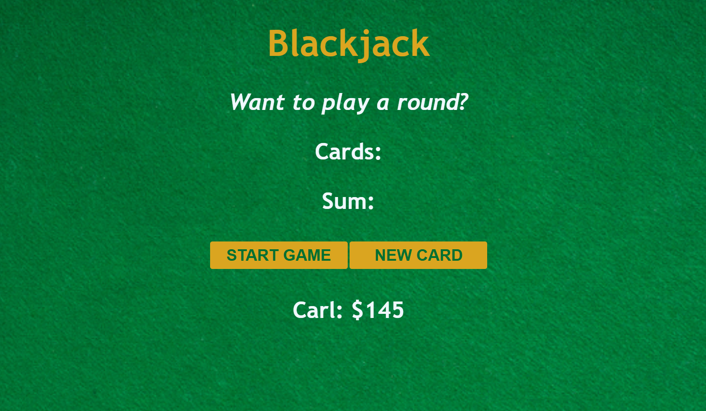

# 🃏 Blackjack Browser Game

A fully interactive, responsive Blackjack game playable directly in the browser. This project was developed as a hands-on assignment within the **Scrimba Frontend Developer Career Path**.

---

## 🚀 Key Features

* **Dynamic Card Generation:** Randomized card values using custom logic to properly handle Aces (valued at 11) and Face Cards (valued at 10).
* **Game State Management:** Continuous tracking of the game flow, detecting whether the player is still in the game, busted, or hit a Blackjack.
* **Dynamic UI Rendering:** Implemented loops to render all drawn cards in real-time onto the screen.
* **Player Profile:** Tracks the player's name and chip count dynamically using JavaScript objects.

---

## 🛠️ Technologies & Concepts Applied

* **HTML5 & CSS3:** Semantics, layout, and a responsive design featuring a custom casino-themed background.
* **Vanilla JavaScript:**
  * DOM Manipulation (`getElementById`, `textContent`).
  * Arrays and array methods (such as `.push()`).
  * `for` loops for dynamic element rendering.
  * Objects (Composite Data Types) to store and manage player data.
  * Complex conditional logic (`if / else if / else`) and boolean operators.

---

## 📈 What I Learned

This project was crucial for mastering game logic and application state flow. A key takeaway was learning how to properly **reset state variables**—such as handling boolean flags when restarting a match—ensuring the game remains fully replayable without requiring a manual browser refresh.

---

## 🔗 Useful Links

* **Repository:** [GitHub Repository](https://github.com/laualways/blackjack)

---

